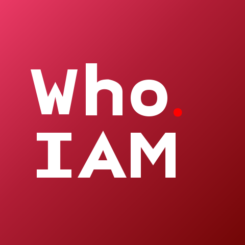

_软著登字第15220256号_

<p align="center">
   
</p>
<p align="center" style="font-size: 20px; font-weight: bold">
   whoIAM - 一种支持多因素认证和私有化部署的企业数字身份管控平台
</p>

<p align="center">
   
   
   
   
   
   
</p>
<p align="center">
   by Yongqi Liang
</p>


#### 📖 产品介绍

whoIAM 是一款支持多因素认证（MFA）与私有化部署的企业级数字身份管控平台。  
通过灵活的OTP认证方式，保障企业应用的安全接入，适配本地和混合云场景，满足身份管理基本功能。

####  📦 部署指南

###### 后端 (Server模块)

1. 配置环境：
   - 在 `server/src/main/resources` 下，修改 `application-dev.properties` 和 `application-prod.properties`，填写数据库、Redis等连接信息。
   - 在 `application.properties` 中设置启用的环境，例如：
     ```properties
     spring.profiles.active=dev
     ```
2. 启动方式：
   - 直接在 IntelliJ IDEA 中运行主类（例如 `ServerApplication`）即可启动后端服务。

###### 前端 (webapp模块)

1. 安装依赖：
   ```bash
   cd webapp
   npm install

2. 本地开发环境运行：

   ```bash
   npm run serve:dev
   ```

3. 生产环境打包：

   ```bash
   npm run build:prod
   ```

###### 文档 (Doc模块)

- `doc` 模块基于 **WriterSide** 生成项目 API 文档。
- 可直接查看或根据需要二次编辑。

###### 移动端示例 (Authenticator模块 & Privileger模块)

- `authenticator` 和 `privileger` 模块为基于 Android Framework 开发的移动端认证应用示例。
- 可使用 Android Studio 打开对应模块，编译并部署到移动设备进行测试。

#### 🤝 贡献方式

欢迎各位开发者参与 whoIAM 的建设！✨

- 提交 Issue：报告Bug或提出功能缺陷&建议。
- Fork 仓库：开发新功能或修复问题，提交 Pull Request。
- 文档完善：帮助改进和扩充文档内容。
- 移动端扩展：丰富Authenticator/Privileger的认证示例。

> 在贡献之前，请先阅读 [CONTRIBUTING.md](./CONTRIBUTING.md) 或在 Issue 区沟通交流。


